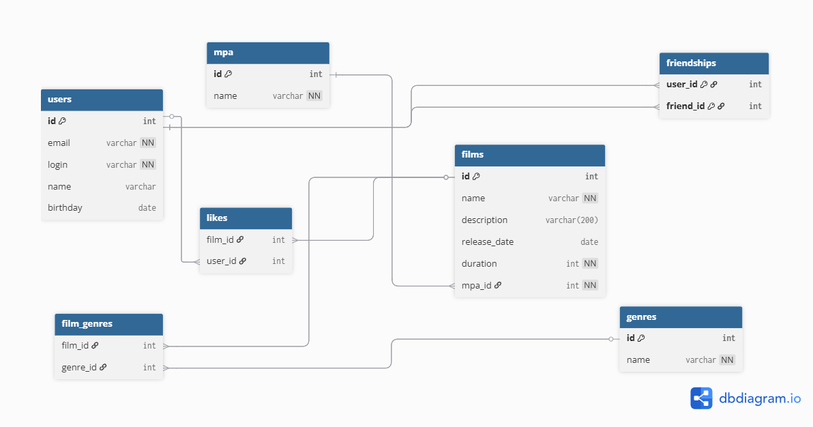

# java-filmorate

Template repository for Filmorate project.
## Схема базы данных



### Основные таблицы

- `users` — пользователи
- `films` — фильмы (FK `mpa_id → mpa.id`)
- `mpa` — справочник возрастных рейтингов
- `genres` — справочник жанров
- `film_genres` — связь фильмов и жанров (многие-ко-многим)
- `likes` — лайки фильмов пользователями
- `friendships` — дружба пользователей (односторонняя модель)

---

### Примеры SQL-запросов (PostgreSQL)

**1. Все фильмы с MPA и жанрами**
```sql
SELECT f.id,
       f.name,
       f.description,
       f.release_date,
       f.duration,
       m.code AS mpa_code,
       m.name AS mpa_name,
       STRING_AGG(g.name, ', ' ORDER BY g.name) AS genres
FROM films f
JOIN mpa m ON f.mpa_id = m.id
LEFT JOIN film_genres fg ON fg.film_id = f.id
LEFT JOIN genres g ON fg.genre_id = g.id
GROUP BY f.id, f.name, f.description, f.release_date, f.duration, m.code, m.name;
```

**2. Топ-N популярных фильмов**
```sql
SELECT f.id,
       f.name,
       COUNT(l.user_id) AS likes_count
FROM films f
LEFT JOIN likes l ON l.film_id = f.id
GROUP BY f.id, f.name
ORDER BY likes_count DESC
LIMIT 10;
```
**3. Друзья пользователя**
```sql
SELECT u.*
FROM friendships fr
JOIN users u ON u.id = fr.friend_id
WHERE fr.user_id = 1;
```
**4. Общие друзья двух пользователей**
```sql
SELECT u.*
FROM friendships a
JOIN friendships b ON a.friend_id = b.friend_id
JOIN users u ON u.id = a.friend_id
WHERE a.user_id = 1
```
